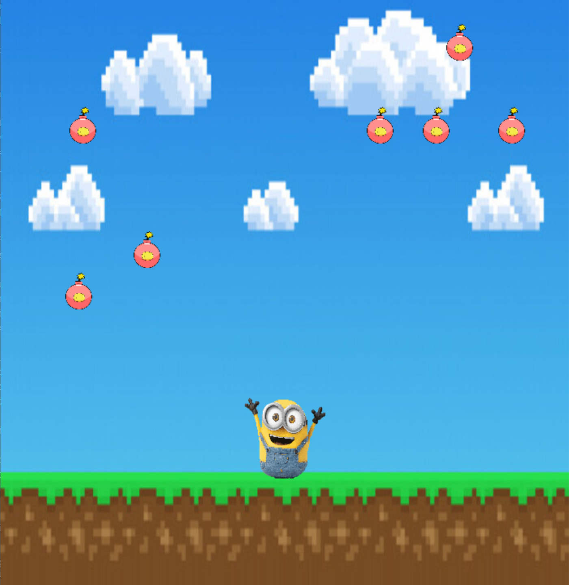
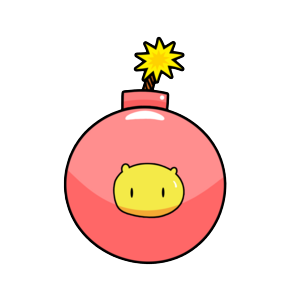

# __Final project of OSS Lab(HGU, 2021-1)__    
__Project name: Implementing a game using pygame in Raspberry pi__   
<p align="center"></img>

* * *

# __Code Description__

#### 1. __Setting bomb to object__   
</img>
```python
bomb_image = pygame.image.load('bomb.png')
bomb_image = pygame.transform.scale(bomb_image, (60, 60))
bombs = []

for i in range(7):
    rect = pygame.Rect(bomb_image.get_rect())
    rect.left = random.randint(0, size[0])
    rect.top = -100
    dy = random.randint(3, 9)
    bombs.append({'rect': rect, 'dy': dy})
```

#### 2. __Setting character to object__   
</img>
```python
character_image = pygame.image.load('character.png')
character_image = pygame.transform.scale(character_image, (100, 100))
character = pygame.Rect(character_image.get_rect())

character.left = size[0] // 2 - character.width // 2
character.top = size[1] - character.height - 180
character_dx = 0
```

#### 3. __Move character with left and right keys__   
```python
for event in pygame.event.get():
         if event.type == pygame.QUIT:
             done = True
             break
         elif event.type == pygame.KEYDOWN:
             if event.key == pygame.K_LEFT:
                 character_dx = -7
             elif event.key == pygame.K_RIGHT:
                 character_dx = 7
         elif event.type == pygame.KEYUP:
             if event.key == pygame.K_LEFT:
                 character_dx = 0
             elif event.key == pygame.K_RIGHT:
                 character_dx = 0
```
#### 4. __Print End Message "Game Over"__   
</img>
```python 
msg = game_font.render("Game Over", True, (255, 100, 100))
msg_rect = msg.get_rect(center=(int(size[0] / 2), int(size[1] / 3)))
screen.blit(msg, msg_rect)
pygame.display.update()
pygame.time.delay(2000)
```
* * *

# __What does this project do?__

* This project is to implement the game and run the game on Raspberry pi.
* It's a game of avoiding bombs falling from the sky.

* * *

# __Why is this project useful?__

* You can use Pygame to implement the game you want.
* You can use Raspberry pi as your own game console.
* If you have a monitor and keyboard, you can enjoy the game anywhere!

* * *

# __How do I get started?__

1. Prepare Pygame code and Raspberry pi.
2. At the Raspberry pi Terminal, enter the code below to install the pygame module.
```
	$ sudo apt-get install python-pygame
```
3. After installation, enter the code below to play the game.
```
	$ python bomb_game.py
```
4. Enjoy the game!

* * *

# __Where can I get more help, if I need it?__

* For more help, please send me email. 21900635@handong.edu

* * *
